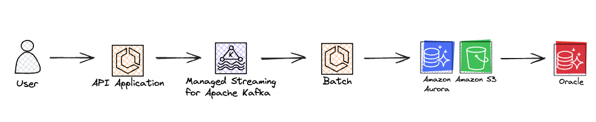
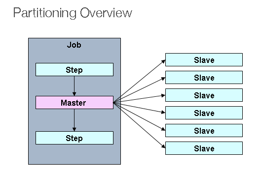
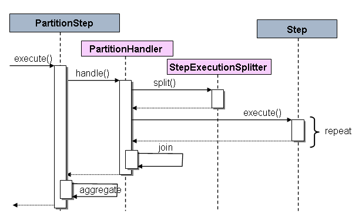
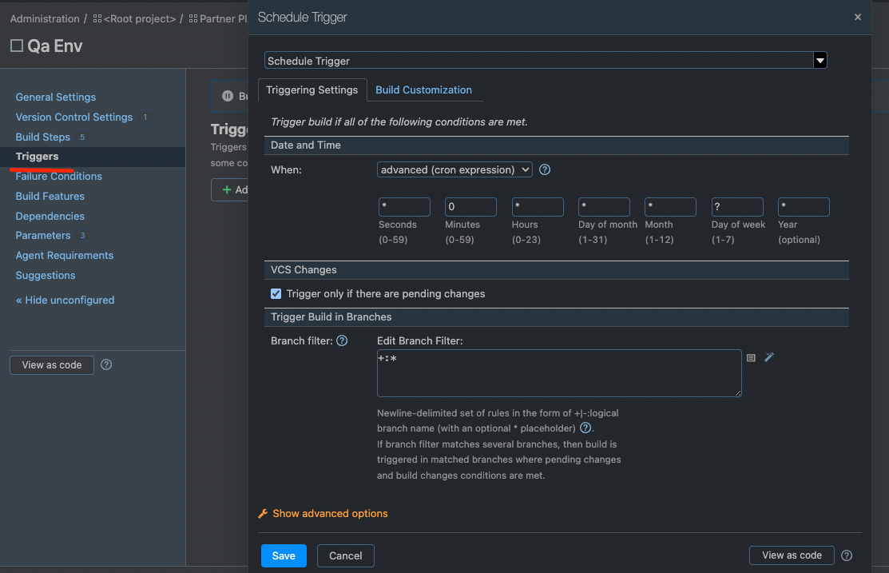
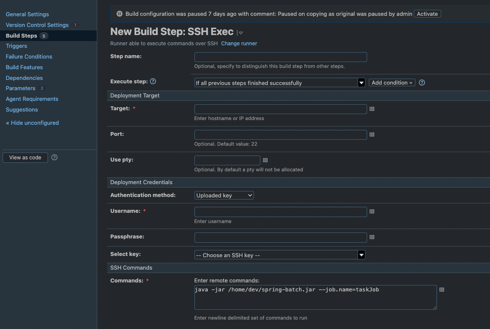

# 확장가능한 데이터 추출 서비스 구축 경험을 공유 
### 안녕하세요. 리테일플랫폼 개발팀에서 백엔드 개발을 담당하는 김한승입니다.
### 파트너오피스를 운영하면서 이슈가 되었던, 엑셀 다운로드 기능 개선 경험에 대해서 공유해보겠습니다.

## 😅 현재의 문제는 아래와 같아요
> 1. 많은 양의 데이터를 데이터베이스에 요청을 하게 되면, 사용자는 데이터베이스의 응답이 끝날때까지 브라우저에서 로딩바만 바라봐야 해요.
>   + 데이터 추출까지 화면에서 대기해야하며, 브라우저를 종료하면 안됨
> 2. 테이블이 많거나, 양이 많은 데이터를 가져 와야 하는 상황이에요.
>   + 서버 자원이 부족한 상황
> 3. 더 큰 문제는 동기 적인 방식의 구조라서 다수인원의 요청까지 들어오게 되면 백엔드 서비스도 부하가 계속 되게 되요.
>   + 백엔드에서 엑셀 생성까지 담당하면 부하가 발생 
----

## 🤔 우리는 이렇게 해결할 계획이에요

> 1. 브라우저를 닫아도 신청한 데이터 추출은 백엔드에서 처리할거에요
>   + Kafka 이벤트를 발생/ 관리하여 데이터 추출서비스에서 자료를 생성하고, 재사용이 가능하도록 재다운로드 기능도 제공
> 2. 백엔드 서버와 엑셀 생성 서버를 분리할거예요
>   + 백엔드와 분리된 데이터 추출 서비스를 생성
> 3. 비동기 이벤트를 발생하여 엑셀 생성에 부하가 없도록 관리할 예정이에요
>   + 이벤트를 관리하여 데이터 추출 서비스가 부하가 없도록 관리

그래서 비동기 방식을 가진, 안정적인 서비스를 제공하기 위해 다음과 같은 3가지의 방법을 적용 해 보았습니다.
> * 첫째 비동기로된 응답 프로세스를 구현했어요.
> * 둘째 데이터베이스로 부터 받은 데이터를 엑셀로 만들어줄 서비스를 별도 생성하여 기존 서버의 로드를 분산 시켰어요
> * 마지막으로 데이터 추출에 유리한 SpringBatch 를 사용하게 되었어요.

시스템 흐름도
> 
> * API Application
>   + 유저가 요청할때 API Application 에서 중복 요청을 방지하여 로드를 낮춤.
> * Kafka
>   + 엑셀 생성 이벤트를 전달하는 부하 분산 브로커를 도입.
> * Batch
>   + 엑셀, json 등 원하는 추출 타입을 만들어 줌.
> * S3
>   + S3 에 업로드된 엑셀은 언제든지 재다운로드 가능

<hr/>

## 😮 SpringBatch ?

SpringBatch 는 다음과 같은 Job 을 갖습니다.
> 1) Job 에는 다양한 Step 이 존재하게 됩니다.
> 2) Job 이 시작하거나 끝날때 listener 를 설정하여 실행 가능해요.
> 3) 개발자는 Step 만 적절히 등록하면 되는 장점이 있어요.
> 4) 멀티 스레드, Spring Bean 들을 그대로 사용할 수 있어요.

```java
@Bean  
public Job partitionJob() {  
  return jobBuilderFactory.get("partitionJob")  
      .incrementer(new UniqueRunIdIncrementer())  
      .start(totalCountTasklet)  
      .next(partitionMainStep)  
      .next(excelMergeTasklet)  
      .next(s3UploadTasklet)  
      .listener(excelJobListener)  
      .build();  
}

@Bean
public Step s3UploadTasklet() {
    return stepBuilderFactory.get("s3UploadTasklet")
    .tasklet(s3UploadTasklet)
    .build();
}
```

JobExecutionListener 는 아래와 같이 사용하였습니다.
> 1) beforeJob 행위로 Job 실행전 임시 폴더를 생성하였구요
> 2) afterJob 행위로 Job 이 종료되었을때 정상 / 비정상에 따라 이벤트를 구분하여 상태를 기록하였어요
```java
@Slf4j
@Component
@RequiredArgsConstructor
public class ExcelJobListener implements JobExecutionListener {

  private final ExcelJobService excelJobService;

  private final FileService fileService;
  
  private String tempFilePath;

  @Override
  public void beforeJob(JobExecution jobExecution) {
    
    fileService.createFile();
  }

  @Override
  public void afterJob(JobExecution jobExecution) {

    ExecutionContext executionContext = jobExecution.getExecutionContext();
    ExportEvent exportEvent = (ExportEvent) executionContext.get(EVENT);
    FileInfo fileInfo = (FileInfo) executionContext.get(FILE_INFO);

    if (jobExecution.getStatus() == BatchStatus.COMPLETED) {
      excelJobService.sendSuccessEvent(exportEvent, fileInfo);
      return;
    }

    excelJobService.sendFailedEvent(jobExecution, exportEvent);
  }
}

```

<hr/>

* SpringBatch 를 사용한 데이터 추출 방식은 병렬처리 하였습니다.
* 아래 4가지가 존재합니다.
> 1. Multi-threaded Step
> 2. Parallel Steps
> 3. Remote Chunking
> 4. Partitioning

<hr/>

데이터 추출 서비스는 아래의 이유로 Partitioning 사용하였습니다.
> * 하나의 데이터 추출 요청에, 역시 하나의 Job 이 실행되고, 다수의 Partitioning 작업이 진행되어 엑셀을 생성하는데 효율적인 방식이에요.
> * 여러 엑셀 파일을 만들고, 최종적으로 한개로 병합 작업 방식을 채택 하였어요.
> * Partitioning은 하나의 Job 에서 다수의 Secondary 를 생성 하게 되요.



> * PartitionStep 의 동작 방식 
>   + 내부적으로 Step을 분할하여 반복 실행하도록 실행되는 구조에요.



<hr/>

* PartitionStep 코드는 아래와 같이 작성 하였어요.
    + PartitionStepBuilder 객체를 통해서 PartitionStep 이 생성되는 방식이에요.

```java
@Bean  
public Step partitionMainStep() {
  return stepBuilderFactory.get("partitionMainStep")  
      .partitioner("subStep", partitioner(null, null, null)) // partitioner 사이즈 및 옵션 부여
      .step(partitionSubStep())  // step 분할 repeat 대상 
      .taskExecutor(taskExecutor) // 동기 or 비동기, task 옵션 설정
      .build();  
}
```


아래는 PartitionStep 을 생성할때 PartitionStepBuilder 의 build() 를 호출하여 객체를 생성 하게 됩니다.
```java
public Step build() {  
 PartitionStep step = new PartitionStep();  
 step.setName(getName());  
 super.enhance(step);  
  
 if (partitionHandler != null) {  
  step.setPartitionHandler(partitionHandler);  
 }  
 else {  
  TaskExecutorPartitionHandler partitionHandler = new TaskExecutorPartitionHandler();  
  partitionHandler.setStep(this.step);  
  if (taskExecutor == null) {  
   taskExecutor = new SyncTaskExecutor();  
  }  
  partitionHandler.setGridSize(gridSize);  
  partitionHandler.setTaskExecutor(taskExecutor);  
  step.setPartitionHandler(partitionHandler);  
 }  
  
 if (splitter != null) {  
  step.setStepExecutionSplitter(splitter);  
 }  
 else {  
  
  boolean allowStartIfComplete = isAllowStartIfComplete();  
  String name = stepName;  
  if (this.step != null) {  
   try {  
    allowStartIfComplete = this.step.isAllowStartIfComplete();  
    name = this.step.getName();  
   }  
   catch (Exception e) {  
    if (logger.isInfoEnabled()) {  
     logger.info("Ignored exception from step asking for name and allowStartIfComplete flag. "  
       + "Using default from enclosing PartitionStep (" + name + "," + allowStartIfComplete + ").");  
    }  
   }  
  }  
  SimpleStepExecutionSplitter splitter = new SimpleStepExecutionSplitter();  
  splitter.setPartitioner(partitioner);  
  splitter.setJobRepository(getJobRepository());  
  splitter.setAllowStartIfComplete(allowStartIfComplete);  
  splitter.setStepName(name);  
  this.splitter = splitter;  
  step.setStepExecutionSplitter(splitter);  
  
 }  
  
 if (aggregator != null) {  
  step.setStepExecutionAggregator(aggregator);  
 }  
  
 try {  
  step.afterPropertiesSet();  
 }  
 catch (Exception e) {  
  throw new StepBuilderException(e);  
 }  
  
 return step;  
  
}
```

아래 PartitionStep Execute 를 실행하여 진행하게 되구요.
```java
protected void doExecute(StepExecution stepExecution) throws Exception {  
  
 if(hasReducer) {  
  reducer.beginPartitionedStep();  
 }  
  
 // Wait for task completion and then aggregate the results  
 Collection<StepExecution> stepExecutions = getPartitionHandler().handle(null, stepExecution);  
 stepExecution.upgradeStatus(BatchStatus.COMPLETED);  
 stepExecutionAggregator.aggregate(stepExecution, stepExecutions);  
  
 if (stepExecution.getStatus().isUnsuccessful()) {  
  if (hasReducer) {  
   reducer.rollbackPartitionedStep();  
   reducer.afterPartitionedStepCompletion(PartitionStatus.ROLLBACK);  
  }  
  throw new JobExecutionException("Partition handler returned an unsuccessful step");  
 }  
  
 if (hasReducer) {  
  reducer.beforePartitionedStepCompletion();  
  reducer.afterPartitionedStepCompletion(PartitionStatus.COMMIT);  
 }  
}
```  

<hr/>

## 🤠 다음은 Batch 호출 방법을 설명 해 볼게요.
#### 1. 시스템 ( TeamCity ) - 서버 원격 호출
> TeamCity Trigger 를 등록 해줍니다.
>
> 아래는 0분 마다 spring-batch.jar 을 실행하는 Build 에 대한 내용이구요.

> * Schedule Trigger 0분 마다 Build 하는 스케줄
>   + 
> * 원격 실행할 수 있는 스크립트 작성
>   + 
#### 2. 스케줄러 사용 ( crontab ) - 서버 직접 등록
> linux 의 crontab -l, e, r 등 명령어로 스케줄 등록
>
> 아래는 0분 마다 spring-batch.jar 을 실행하는 스케줄


#### 3. Kafka Consume - 이벤트 호출
> kafka의 이벤트가 발행 되었을때마다 consume 합니다.
>
> 배치의 실행은 스케줄러가 아닌 이벤트의해 트리거됩니다.

* @KafkaListener 를 사용하여, Consume 하도록 설정
```java
@KafkaListener(  
    topics = "${spring.kafka.topic}",  
    clientIdPrefix = "${spring.kafka.topic.client-id}"  
)  
public void batchConsumer() throws JobInstanceAlreadyCompleteException, JobExecutionAlreadyRunningException, JobParametersInvalidException, JobRestartException, JsonProcessingException {   
  
  createJobLauncher.run(partitionJob,  
        new JobParametersBuilder()  
            .toJobParameters()  
    );  
}
```

<hr/>

## 🙂 마무리
스프링 배치를 스케쥴러 방식 보다 이벤트 방식으로 사용하게 되면서,

이벤트 방식은 어떻게 사용을 해야 하는지, 또 구조는 어떻게 설계 해야 하는지 등을 알게 되는 경험이였습니다.

또한, 레거시의 기능을 보다 안전하게 운영하기 위한 방법에 대해 고민 할 수 있는 시간이기도 했습니다.

그럼 여기까지 제 경험을 공유하고 이만 마무리 해보겠습니다.

읽어 주셔서 감사합니다.


<hr/>
References
<br>
https://docs.spring.io/spring-batch/docs/current/reference/html/scalability.html#partitioning 
