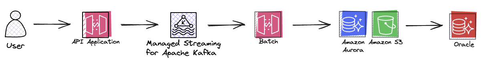

# 확장가능한 데이터 추출 서비스 구축

## 😅 현재의 문제
> 1. 대량의 데이터를 추출 하고자 할때, 사용자가 화면에서 대기를 경험
> 2. 무거운 테이블이나, 많은 데이터를 추출할때 시간이 오래걸림
> 3. 동기 호출로 인해 다수인원 엑셀 다운로드시 전체 백엔드 서비스 과부하
----

## 🤔 계획
비동기로 안정적인 서비스를 제공하기위해 아래 3가지를 고려하였습니다.
> * 비동기 응답 프로세스로 구현
> * 부하 전파 방지를 위한 엑셀 생성 서비스 별도 구축
> * 데이터 추출에 유리한 SpringBatch 를 사용

시스템 흐름도
> 
> * API Application
>   + 유저가 요청할때 API Application 에서 중복 요청 방지 처리
> * Kafka
>   + 엑셀 생성 이벤트를 전달
> * Batch
>   + 엑셀, json 등 원하는 추출 타입을 구현
> * S3
>   + S3 에 업로드된 엑셀은 언제든지 바로 재다운로드가 가능

<hr/>

## 😮 SpringBatch ?


SpringBatch 는 다음과 같은 Job 을 갖습니다.
> 1) Job 에는 다양한 Step 이 존재
> 2) Job 이 시작하거나 끝날때 listener 를 설정하여 실행 가능
> 3) 개발자는 Step 만 적절히 등록하면 됨

```java
@Bean  
public Job partitionJob() {  
  return jobBuilderFactory.get("partitionJob")  
      .incrementer(new UniqueRunIdIncrementer())  
      .start(totalCountTasklet)  
      .next(partitionMainStep)  
      .next(excelMergeTasklet)  
      .next(s3UploadTasklet)  
      .listener(excelJobListener)  
      .build();  
}
```

* SpringBatch 사용하여 데이터를 추출할땐 병렬처리 방식을 사용하였습니다.
* 병렬처리 방식은 4가지가 존재합니다.
 > 1. Multi-threaded Step
 > 2. Parallel Steps
 > 3. Remote Chunking
 > 4. Partitioning

<hr/>

데이터 추출 서비스는 아래의 이유로 Partitioning 사용하였습니다.
> * 하나의 데이터 추출 요청에 하나의 Job 이 실행되고 ,다수의 Partitioning 작업이 진행되어 엑셀 생성에 효율적
> * 여러 엑셀 파일을 만들고 하나로 병합 작업 방식을 채택
> * Partitioning은 하나의 Job 에서 다수의 Secondary 생성


> * PartitionStep 의 동작 방식
>  + 내부적으로 Step을 분할하여 반복 실행하도록 실행됩니다.


<hr/>

* PartitionStep 코드는 아래와 같이 작성
  + PartitionStepBuilder 객체를 통해서 PartitionStep 생성됩니다.

```java
@Bean  
public Step partitionMainStep() {
  return stepBuilderFactory.get("partitionMainStep")  
      .partitioner("subStep", partitioner(null, null, null)) // partitioner 사이즈 및 옵션 부여
      .step(partitionSubStep())  // step 분할 repeat 대상 
      .taskExecutor(taskExecutor) // 동기 or 비동기, task 옵션 설정
      .build();  
}
```


아래는 PartitionStep 을 생성할때 PartitionStepBuilder 의 build() 를 호출하여 객체를 생성합니다.
```java
public Step build() {  
 PartitionStep step = new PartitionStep();  
 step.setName(getName());  
 super.enhance(step);  
  
 if (partitionHandler != null) {  
  step.setPartitionHandler(partitionHandler);  
 }  
 else {  
  TaskExecutorPartitionHandler partitionHandler = new TaskExecutorPartitionHandler();  
  partitionHandler.setStep(this.step);  
  if (taskExecutor == null) {  
   taskExecutor = new SyncTaskExecutor();  
  }  
  partitionHandler.setGridSize(gridSize);  
  partitionHandler.setTaskExecutor(taskExecutor);  
  step.setPartitionHandler(partitionHandler);  
 }  
  
 if (splitter != null) {  
  step.setStepExecutionSplitter(splitter);  
 }  
 else {  
  
  boolean allowStartIfComplete = isAllowStartIfComplete();  
  String name = stepName;  
  if (this.step != null) {  
   try {  
    allowStartIfComplete = this.step.isAllowStartIfComplete();  
    name = this.step.getName();  
   }  
   catch (Exception e) {  
    if (logger.isInfoEnabled()) {  
     logger.info("Ignored exception from step asking for name and allowStartIfComplete flag. "  
       + "Using default from enclosing PartitionStep (" + name + "," + allowStartIfComplete + ").");  
    }  
   }  
  }  
  SimpleStepExecutionSplitter splitter = new SimpleStepExecutionSplitter();  
  splitter.setPartitioner(partitioner);  
  splitter.setJobRepository(getJobRepository());  
  splitter.setAllowStartIfComplete(allowStartIfComplete);  
  splitter.setStepName(name);  
  this.splitter = splitter;  
  step.setStepExecutionSplitter(splitter);  
  
 }  
  
 if (aggregator != null) {  
  step.setStepExecutionAggregator(aggregator);  
 }  
  
 try {  
  step.afterPropertiesSet();  
 }  
 catch (Exception e) {  
  throw new StepBuilderException(e);  
 }  
  
 return step;  
  
}
```

아래 PartitionStep Execute 를 실행하여 진행하게됩니다.
```java
protected void doExecute(StepExecution stepExecution) throws Exception {  
  
 if(hasReducer) {  
  reducer.beginPartitionedStep();  
 }  
  
 // Wait for task completion and then aggregate the results  
 Collection<StepExecution> stepExecutions = getPartitionHandler().handle(null, stepExecution);  
 stepExecution.upgradeStatus(BatchStatus.COMPLETED);  
 stepExecutionAggregator.aggregate(stepExecution, stepExecutions);  
  
 if (stepExecution.getStatus().isUnsuccessful()) {  
  if (hasReducer) {  
   reducer.rollbackPartitionedStep();  
   reducer.afterPartitionedStepCompletion(PartitionStatus.ROLLBACK);  
  }  
  throw new JobExecutionException("Partition handler returned an unsuccessful step");  
 }  
  
 if (hasReducer) {  
  reducer.beforePartitionedStepCompletion();  
  reducer.afterPartitionedStepCompletion(PartitionStatus.COMMIT);  
 }  
}
```  

<hr/>

## 🤠 Batch 호출 방법
#### 1. 시스템 ( TeamCity ) - 서버 원격 호출
> TeamCity Trigger 등록
>
> 아래는 0분 마다 spring-batch.jar 을 실행하는 Build

* Schedule Trigger 0분 마다 Build 하는 스케줄

* 원격 실행할 수 있는 스크립트 작성

#### 2. 스케줄러 사용 ( crontab ) - 서버 직접 등록
> linux 의 crontab -l, e, r 등 명령어로 스케줄 등록
>
> 아래는 0분 마다 spring-batch.jar 을 실행하는 스케줄


#### 3. Kafka Consume - 이벤트 호출
> kafka의 이벤트가 발행 되었을때마다 consume 합니다.
> 
> 배치의 실행은 스케줄러가 아닌 이벤트의해 트리거됩니다.

* @KafkaListener 를 사용하여, Consume 하도록 설정
```java
@KafkaListener(  
    topics = "${spring.kafka.topic}",  
    clientIdPrefix = "${spring.kafka.topic.client-id}"  
)  
public void batchConsumer() throws JobInstanceAlreadyCompleteException, JobExecutionAlreadyRunningException, JobParametersInvalidException, JobRestartException, JsonProcessingException {   
  
  createJobLauncher.run(partitionJob,  
        new JobParametersBuilder()  
            .toJobParameters()  
    );  
}
```
 
<hr/>

## 🙂 마무리
스프링 배치를 스케줄러가 아닌 이벤트 방식으로 어떻게 사용하였는지, 왜 이런 구조를 설계하였는지 공유할 수 있었습니다.

레거시 기능을 보다 안전하게 운영하기위해 고민하고있습니다.

감사합니다.


참고 사이트
https://docs.spring.io/spring-batch/docs/current/reference/html/scalability.html#partitioning 
